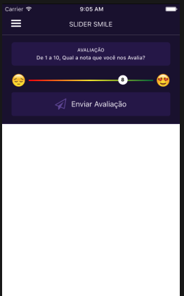

# react-native-slider-smile

#### top = false


#### top = true


## Custom Slider Smile
> This component is based on the slider, it was just customized

| Props | Value Type | Description | Default |
|--|--|--|--|
| value | Number | value from sets Slider controller | 5 |
| onValueChange | function) | function that monitors the change in value | ()=>{} |
| top | layout | put smiles above the bar | false |
| showInText | array | set a text from number selected | [] |
| showNumber | bool | show value in pin slider | true |

## Install
> npm i react-native-slider-smile

## Usage :
### 1- add below import in your code :
```js
import { SliderSmile } from "react-native-slider-smile";
```
### 2- Define the props according to the documentation above or copy the example below.

```js
<SliderSmile
    top={true}
    value={valor}                                                                
    onValueChange={v => setValor(Math.trunc(v))}
    showInText={{
        1: 'Very Bad',
        2: 'Bad',
        3: 'Not so bad',
        4: 'Ok',
        5: 'Medium',
        6: 'Cool',
        7: 'Good',
        8: 'Very good',
        9: 'Fantastic',
        10: 'Excellent'
    }}
/>
```
